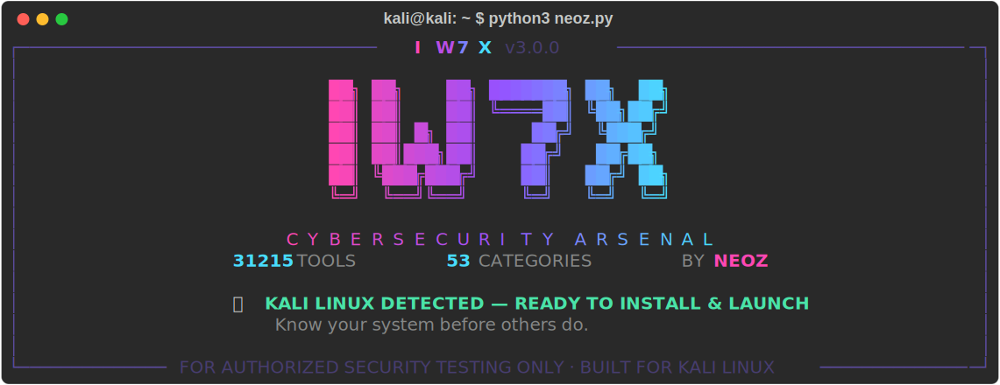

<div align="center">

<h1>⚡ iw7x</h1>

### Tous les outils de cybersécurité du monde — dans un seul terminal Kali Linux.

**iw7x** réunit **12 669** outils de sécurité offensifs & défensifs — de Nmap à BloodHound, de Metasploit à Volatility — dans un seul arsenal en ligne de commande qui **installe, met à jour et lance** n'importe lequel pour vous. Conçu pour Kali Linux. Gratuit pour toujours.

<br/>

[](https://github.com/isneoz1/iw7x-cyber-security/stargazers)
[](https://github.com/isneoz1/iw7x-cyber-security/network/members)
[](LICENSE)

[](catalog.json)
[](#larsenal--50-catégories-12-669-outils)
[](https://www.python.org/)
[](https://www.kali.org/)
[](https://isneoz1.github.io/iw7x-cyber-security/)

**[English](README.md) · [Français](README.fr.md)** &nbsp;·&nbsp; **[Site web en ligne →](https://isneoz1.github.io/iw7x-cyber-security/)**

<br/>



</div>

> ⚠️ **Réservé aux tests de sécurité autorisés et à l'éducation.** Lisez [Usage légal & éthique](#usage-légal--éthique) avant de commencer. Sans autorisation écrite pour tester un système, arrêtez‑vous.

---

## Un mot de NeoZ

Je suis NeoZ, et j'ai créé iw7x pour une seule raison : j'en avais assez de perdre des soirées entières à installer des outils au lieu de hacker.

À chaque mission, chaque CTF, chaque lab, ça commençait pareil — dix onglets ouverts, cloner un dépôt, réparer une dépendance cassée, relire un README pour retrouver la bonne option d'installation, abandonner, essayer un autre outil. Le vrai travail de sécurité finissait toujours enterré sous la plomberie.

Alors j'ai construit ce que j'aurais voulu avoir : **un terminal qui connaît déjà tous les outils, les installe correctement pour Kali, et les lance pour vous.** Vous pensez « il faut que j'énumère cet Active Directory » — vous tapez `iw7x` et c'est lancé. C'est toute l'idée.

C'est un projet de passion. Je le garde gratuit, open source, et il grandit sans cesse. S'il vous épargne ne serait‑ce qu'une de ces soirées perdues, **mettez une étoile** pour que la personne suivante le trouve aussi. C'est tout ce que je demande. — *NeoZ*

---

## Pourquoi vous allez vraiment l'utiliser

| | |
|---|---|
| **Tout l'écosystème** | **12 669 outils** dans **50 catégories** — OSINT, web, sans‑fil, exploitation, forensique, reverse, crypto, cloud, Active Directory, mobile, IoT, CTF, honeypots, threat hunting, blue team et bien plus. |
| **Il installe & lance pour vous** | Choisissez un outil → iw7x exécute le bon `apt` / `pipx` / `go` / `git` et le lance. Fini le copier‑coller depuis douze README. |
| **Conçu pour Kali** | Il détecte votre distribution et réécrit même `pacman` ↔ `apt`, pour que les outils issus de BlackArch s'installent proprement sur Kali. |
| **Ne s'arrête jamais de grandir** | Un scanner intégré récupère de nouveaux outils depuis **BlackArch, Kali & 75+ awesome‑lists** — et continue de collecter **en arrière‑plan pendant que vous travaillez**, donc les nouveaux outils apparaissent automatiquement, sans jamais redémarrer. |
| **Trouvez tout, vite** | Recherche plein‑texte, filtres par tag (`osint`, `c2`, `web`…) et un **conseiller** qui recommande des outils selon la tâche que vous décrivez. |
| **Jamais de traceback** | Mauvais nom, binaire absent, hors‑ligne ? Vous obtenez un message clair — jamais une erreur brute. |

---

## Étape 1 — Installer Kali Linux

iw7x exécute ses outils sur **[Kali Linux](https://www.kali.org/)**. Si vous avez déjà Kali, passez à l'[Étape 2](#étape-2--installer-iw7x). Sinon, choisissez la méthode qui vous convient — toutes sont gratuites et officielles.

<details open>
<summary><b>🖥️ Option A — Machine virtuelle (le plus simple, recommandé)</b></summary>

Faites tourner Kali en toute sécurité dans votre OS actuel (Windows/macOS/Linux). Aucun dual‑boot.

1. Installez [VirtualBox](https://www.virtualbox.org/wiki/Downloads) (gratuit) — ou VMware.
2. Téléchargez l'**image VirtualBox de Kali** prête à l'emploi : <https://www.kali.org/get-kali/#kali-virtual-machines>
3. Dans VirtualBox : **Fichier → Importer un appareil virtuel →** sélectionnez le fichier → **Importer**.
4. Démarrez la VM. Identifiants : `kali` / `kali`.
5. Mettez à jour une fois : `sudo apt update && sudo apt -y full-upgrade`

</details>

<details>
<summary><b>🪟 Option B — Windows sans VM (WSL2)</b></summary>

Faites tourner Kali comme une application Windows. Ouvrez **PowerShell en administrateur** :

```powershell
wsl --install
wsl --install -d kali-linux
```

Redémarrez si demandé, lancez **Kali Linux** depuis le menu Démarrer, créez votre utilisateur, puis :

```bash
sudo apt update && sudo apt -y full-upgrade
```

> Pour les outils graphiques dans WSL, installez Win‑KeX : `sudo apt install -y kali-win-kex`.

</details>

<details>
<summary><b>💾 Option C — Installation native / dual boot (meilleures performances)</b></summary>

1. Téléchargez l'**ISO d'installation Kali** : <https://www.kali.org/get-kali/#kali-installer-images>
2. Flashez‑la sur une clé USB de 8 Go+ avec [balenaEtcher](https://etcher.balena.io/) (tout OS) ou [Rufus](https://rufus.ie/) (Windows).
3. Démarrez le PC sur la clé USB (souvent `F12` / `Échap` / `Suppr` au démarrage pour choisir le périphérique).
4. Choisissez **Graphical Install** et suivez les étapes. Vous pouvez installer à côté de votre OS actuel.

</details>

<details>
<summary><b>🔌 Option D — Live USB (essayer sans rien installer)</b></summary>

Envie de tester d'abord ? Flashez l'image **Kali Live** (mêmes outils), démarrez sur la clé et choisissez **Live**. Tout tourne en RAM — rien ne touche votre disque.

</details>

> Sur un Mac Apple Silicon ? Utilisez l'image VM **Apple Silicon / ARM64** depuis la même page de téléchargement.

---

## Étape 2 — Installer iw7x

Sur votre machine Kali :

```bash
# 1. Cloner
git clone https://github.com/isneoz1/iw7x-cyber-security.git
cd iw7x-cyber-security

# 2. Installer les dépendances (git, python, pipx, go…)
chmod +x install.sh && ./install.sh

# 3. Lancer l'arsenal
python3 neoz.py
```

C'est tout. Au premier lancement, iw7x récupère le catalogue complet pour que chaque outil soit à une touche.

<details>
<summary><b>⚡ En une ligne</b></summary>

```bash
git clone https://github.com/isneoz1/iw7x-cyber-security.git && cd iw7x-cyber-security && chmod +x install.sh && ./install.sh && python3 neoz.py
```
</details>

---

## En action

**Installez et lancez n'importe quel outil par son nom** — iw7x gère l'installation, puis l'ouvre :

```console
$ python3 neoz.py nmap
[iw7x] Installing Nmap ...
[iw7x] Launching Nmap ...
Nmap 7.94 ( https://nmap.org )
Usage: nmap [Scan Type(s)] [Options] {target specification}
```

**Pas sûr de l'outil ? Demandez au conseiller** — appuyez sur `R` dans le menu et décrivez la tâche :

```text
Que voulez-vous faire ?
  1  Scanner un réseau            5  Auditer Active Directory
  2  Trouver des sous-domaines    6  Casser des mots de passe
  3  OSINT sur une cible          7  Capturer un handshake Wi-Fi
  4  Auditer une application web  8  Post-exploitation / C2
> 5
Recommandé pour : Auditer Active Directory
  NetExec · BloodHound.py · Impacket · Certipy · Kerbrute · Responder · mitm6 …
```

**Des workflows réels, une ligne chacun :**

```bash
python3 neoz.py sherlock              # traquer un pseudo sur 400+ sites
python3 neoz.py nuclei                # scan de vulnérabilités par templates
python3 neoz.py bloodhound            # cartographier les chemins d'attaque AD
python3 neoz.py hashcat               # casser des hash sur votre GPU
python3 neoz.py search "wifi"         # tous les outils sans-fil, instantanément
python3 neoz.py list active_directory # parcourir une catégorie entière
```

**Installez tout un kit pour la tâche en une commande** — les bundles :

```bash
python3 neoz.py bundles               # lister tous les kits
python3 neoz.py bundle web            # kit pentest web (nmap, nuclei, ffuf, sqlmap…)
python3 neoz.py bundle ad             # kit Active Directory (NetExec, BloodHound, Impacket…)
python3 neoz.py bundle osint          # kit OSINT
# 15 kits — aussi : wireless, pwn, forensics, cloud, passwords, c2, mobile, recon, bugbounty, malware, container, stego
```

**Vous préférez le menu ?** Lancez `python3 neoz.py` et pilotez au clavier :

| Touche | Action |
|:---:|--------|
| `1–N` | Ouvrir une catégorie |
| `/requête` | Chercher un outil par nom / mot-clé |
| `T` | Filtrer par tag (`osint`, `web`, `c2`, `wireless`…) |
| `R` | Conseiller — décrivez la tâche, obtenez les outils |
| `U` | Mettre à jour — récupérer tous les nouveaux outils |
| `?` · `Q` | Aide · Quitter |

---

## L'arsenal — 50 catégories, 12 669 outils

Chaque domaine de la sécurité offensive et défensive, au même endroit — et ça grandit à chaque `--update`.

| Catégorie | Outils | Catégorie | Outils |
|---|:--:|---|:--:|
| 🕵️ OSINT / Recon | 2348 | 🎣 Phishing | 59 |
| 🧰 Boîte à outils / OSINT | 1702 | 🚪 Physique / RFID | 57 |
| 🌐 Attaque Web | 1667 | 🖼️ Stéganographie | 54 |
| 🔍 Collecte d'infos | 1298 | 🚗 Automobile / CAN | 49 |
| 🔬 Forensique / DFIR | 684 | 🎛️ Post-exploitation / C2 | 47 |
| 🧠 Rétro-ingénierie | 497 | 🎭 Ingénierie sociale | 45 |
| 📶 Sniffing & MITM | 364 | 💣 DDoS / Stress test | 44 |
| 🔐 Cryptographie | 233 | 📻 Radio / SDR / RF | 42 |
| 🍯 Honeypots / Déception | 232 | ⛓️ Blockchain / Web3 | 41 |
| 🔑 Wordlists / Mots de passe | 231 | 📦 Conteneurs / K8s | 38 |
| 🔌 IoT / Firmware | 229 | ☎️ Sécurité VoIP | 34 |
| 🏰 Active Directory | 203 | ☁️ Sécurité cloud | 32 |
| 🧬 Analyse de malware | 202 | 🐺 Chasse aux menaces | 30 |
| 💥 Framework d'exploit | 198 | 📤 Exfiltration de données | 26 |
| 🛡️ Blue Team / Défense | 186 | ♻️ DevSecOps | 25 |
| 🔗 Sécurité API | 167 | 💉 Injection SQL | 21 |
| 📱 Sécurité mobile | 130 | 🧱 Supply Chain / SBOM | 17 |
| 📡 Attaque sans-fil | 128 | 🧪 Sandbox de malware | 15 |
| ⏫ Élévation de privilèges | 125 | 🩹 Attaque XSS | 14 |
| 🧨 Exploitation binaire | 118 | 🥷 Anonymat | 13 |
| 🎯 Création de payloads | 107 | 🖥️ Admin distant (RAT) | 11 |
| 🔭 Threat Intelligence | 94 | 🛰️ Satellite / GNSS | 9 |
| 🩻 Scan de vulnérabilités | 90 | 🤖 Sécurité IA / ML | 9 |
| 🚩 CTF / Wargames | 82 | 🏭 ICS / SCADA / OT | 8 |
| 🐝 Fuzzing | 75 | 🎮 Piratage de jeux | 7 |

<details>
<summary><b>Un aperçu du contenu</b></summary>

`Nmap` · `Masscan` · `theHarvester` · `Amass` · `SpiderFoot` · `Sherlock` · `Nuclei` · `Burp Suite` · `OWASP ZAP` · `SQLmap` · `ffuf` · `Gobuster` · `Aircrack‑ng` · `Bettercap` · `Wifite` · `Hashcat` · `John the Ripper` · `Hydra` · `Metasploit` · `Sliver` · `Havoc` · `Empire` · `BloodHound` · `Impacket` · `NetExec` · `Responder` · `Certipy` · `Ghidra` · `radare2` · `Frida` · `jadx` · `Volatility` · `Autopsy` · `binwalk` · `YARA` · `Prowler` · `Pacu` · `MobSF` · `Wireshark` · `evilginx` · `Cowrie` · `CTFd` · … et des milliers d'autres.

</details>

---

## Il grandit tout seul

iw7x n'est pas une liste figée. Lancez `--update` (ou appuyez sur `U`) et il scanne **BlackArch**, **Kali** et 70+ **awesome‑lists** communautaires, déduplique, et ajoute chaque nouvel outil trouvé — commandes d'installation prêtes.

```bash
python3 neoz.py --update          # scan complet ponctuel
python3 neoz.py --watch 60        # continue de scanner toutes les heures
```

Le but est simple : **tous les outils de sécurité de la planète, toujours à jour, au même endroit.**

---

## Contribuer

iw7x grandit grâce à des gens comme vous. Ajouter un outil est la contribution open‑source la plus simple qui soit — un objet JSON :

```json
{
  "title": "Subfinder",
  "description": "Énumération passive et rapide de sous-domaines.",
  "install": ["go install -v github.com/projectdiscovery/subfinder/v2/cmd/subfinder@latest"],
  "run": ["subfinder -d example.com"],
  "url": "https://github.com/projectdiscovery/subfinder",
  "tags": ["osint", "recon"]
}
```

Ajoutez‑le à `catalog.json`, ouvrez une PR — c'est fait. Voir **[CONTRIBUTING.md](CONTRIBUTING.md)**, ou [demandez un outil](https://github.com/isneoz1/iw7x-cyber-security/issues/new/choose) et je l'ajoute.

---

## Usage légal & éthique

iw7x est un framework de **test d'intrusion et d'éducation à la sécurité**, destiné **uniquement** à :

- Des systèmes que vous **possédez** ou pour lesquels vous avez une **autorisation écrite explicite**
- L'apprentissage, les CTF, les labs et les missions red‑team autorisées
- La recherche défensive et le travail blue‑team

**L'accès non autorisé à un système informatique est illégal.** Vous êtes seul responsable de vos actes et du respect des lois applicables. Les auteurs déclinent **toute responsabilité** en cas de mauvais usage. Pas d'autorisation ? On arrête.

---

## Licence

Distribué sous [licence MIT](LICENSE). Les outils distribués via le catalogue conservent **leurs propres** licences respectives.

---

<div align="center">

### Si iw7x vous fait gagner du temps, mettez une étoile ⭐

Ce simple clic, c'est comme ça que le prochain hacker le découvre.

**⭐ Star · 🔀 Fork · 🐛 Signaler un bug · 🧩 Ajouter un outil · 📣 Partager**

<br/>

[](https://star-history.com/#isneoz1/iw7x-cyber-security&Date)

<br/>

**Fait avec une vraie passion par [NeoZ](https://github.com/isneoz1).**

<sub>Plus vous devenez silencieux, plus vous pouvez entendre.</sub>

</div>
